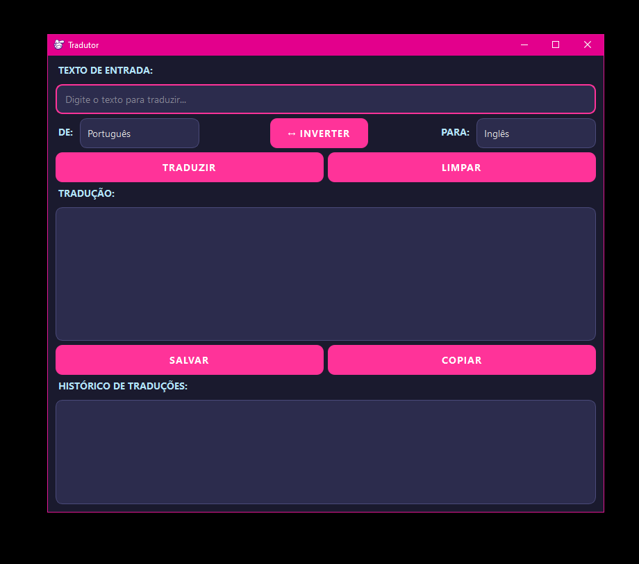

# 🈂️ Tradutor Multilíngue com PySide6

Este é um aplicativo gráfico de tradução de textos desenvolvido em **Python** utilizando **PySide6**. Ele permite traduzir entre diversos idiomas, utilizando a API **MyMemory** para traduções online.

---

## ✨ Visão Geral e Melhorias Recentes

Este projeto foi aprimorado para oferecer uma experiência de usuário mais fluida e um design moderno. As principais melhorias incluem:

* **Interface Futurista:** Um tema escuro aprimorado com cores vibrantes, bordas arredondadas e espaçamento refinado para uma estética moderna.
* **Performance Otimizada:** As operações de tradução e detecção de idioma agora rodam em segundo plano (usando `QThreadPool`), garantindo que a interface gráfica permaneça responsiva e sem travamentos.
* **Feedback Não Intrusivo:** Mensagens de aviso e informação são exibidas diretamente na interface (em um label de status temporário), eliminando pop-ups intrusivos.
* **UX Aprimorada:**
    * **Detecção Automática de Idioma:** Identifica automaticamente o idioma do texto de entrada (atualmente com lógica básica, pois a MyMemory API gratuita não oferece detecção avançada).
    * **Botão "Inverter":** Troca rapidamente os idiomas de origem e destino.
    * **Botão "Limpar":** Reseta facilmente os campos de texto e seleções de idioma.
    * **Indicador de Carregamento:** Feedback visual claro durante o processo de tradução.
* **Modularidade:** A lógica de tradução foi separada da interface gráfica, tornando o código mais limpo, fácil de manter e testar.
* **Ícone Personalizado:** Um ícone dedicado para a janela do aplicativo, aprimorando sua identidade visual.
* **Compilação para Executável:** Capacidade de empacotar o aplicativo em um único arquivo `.exe` para Windows.

### Exemplo do Aplicativo em Ação



---

## 🚀 Funcionalidades

* Tradução entre vários idiomas (Português, Inglês, Espanhol, Francês, Alemão, Italiano, Japonês, Coreano, Russo, Chinês Simplificado, Árabe, Hindi) utilizando a **MyMemory API**.
* Detecção automática do idioma de entrada (funcionalidade básica).
* Tradução automática após digitação (com debounce de 1 segundo).
* Histórico de traduções realizadas, com a possibilidade de recarregar traduções anteriores.
* Copiar tradução para área de transferência com um clique.
* Salvar traduções em um arquivo `.txt`.
* Inverter rapidamente os idiomas de origem e destino.
* Limpar todos os campos de entrada e saída.
* Interface responsiva e moderna com PySide6.
* Execução de tarefas de tradução em segundo plano para evitar travamentos da UI.
* Mensagens de status não intrusivas (avisos e informações).

---

## 📦 Tecnologias e Bibliotecas

* [Python 3.x](https://www.python.org/) (Recomendado Python 3.10 ou anterior para compatibilidade mais ampla, ou use Python 3.11+ com `requests` para MyMemory API).
* [PySide6](https://doc.qt.io/qtforpython/) - O framework Qt para Python, utilizado para a interface gráfica.
* [Requests](https://requests.readthedocs.io/en/latest/) - Biblioteca HTTP para interagir com a MyMemory API.
* **MyMemory API** (Serviço de Tradução Online).
* [Pillow](https://pillow.readthedocs.io/en/stable/) - Biblioteca de processamento de imagens (necessária para o PyInstaller ao usar ícones PNG).
* [PyInstaller](https://pyinstaller.org/en/stable/) - Ferramenta para empacotar o aplicativo em um executável.

---

## 🛠️ Instalação e Execução

### 1. Pré-requisitos

Certifique-se de ter o Python 3.x instalado em seu sistema.

### 2. Dependências

Recomenda-se **fortemente** criar um ambiente virtual para isolar as dependências do projeto.

```bash
# Crie um ambiente virtual (opcional, mas recomendado)
python -m venv venv

# Ative o ambiente virtual
# No Windows:
.\venv\Scripts\activate
# No macOS/Linux:
source venv/bin/activate

# Instale as bibliotecas necessárias
# Nota: 'googletrans' foi removido devido a incompatibilidades com Python 3.11+
# Agora usa 'requests' para a MyMemory API.
pip install PySide6 requests Pillow pyinstaller

tradutor-de-linguagens/
├── main.py
├── translator_logic.py
├── images/
│   └── logo.png                
├── └── logo.ico             
│   └── app_screenshot.png
└── README.md